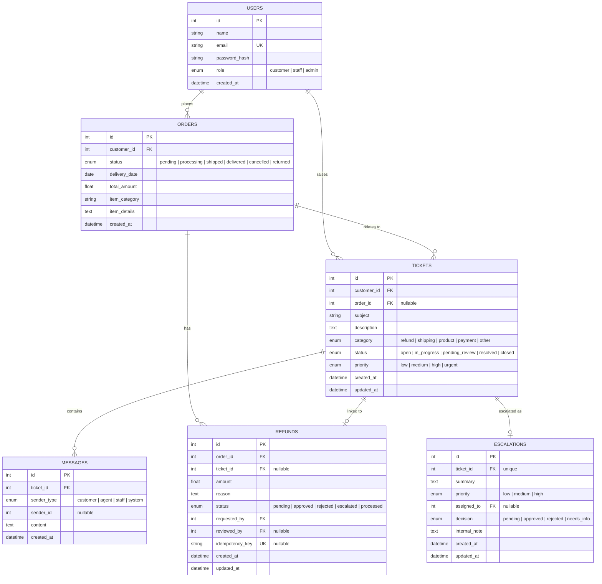

# Database Schema & ER Diagram

The database uses **PostgreSQL** with 6 core tables managed via SQLAlchemy ORM (`backend/app/models/`).

```mermaid
erDiagram
    USERS ||--o{ ORDERS : places
    USERS ||--o{ TICKETS : raises
    ORDERS ||--o{ TICKETS : "relates to"
    ORDERS ||--o{ REFUNDS : "has"
    TICKETS ||--o{ MESSAGES : contains
    TICKETS ||--o| REFUNDS : "linked to"
    TICKETS ||--o| ESCALATIONS : "escalated as"

    USERS {
        int id PK
        string name
        string email UK
        string password_hash
        enum role "customer | staff | admin"
        datetime created_at
    }

    ORDERS {
        int id PK
        int customer_id FK
        enum status "pending | processing | shipped | delivered | cancelled | returned"
        date delivery_date
        float total_amount
        string item_category
        text item_details
        datetime created_at
    }

    TICKETS {
        int id PK
        int customer_id FK
        int order_id FK "nullable"
        string subject
        text description
        enum category "refund | shipping | product | payment | other"
        enum status "open | in_progress | pending_review | resolved | closed"
        enum priority "low | medium | high | urgent"
        datetime created_at
        datetime updated_at
    }

    MESSAGES {
        int id PK
        int ticket_id FK
        enum sender_type "customer | agent | staff | system"
        int sender_id "nullable"
        text content
        datetime created_at
    }

    REFUNDS {
        int id PK
        int order_id FK
        int ticket_id FK "nullable"
        float amount
        text reason
        enum status "pending | approved | rejected | escalated | processed"
        int requested_by FK
        int reviewed_by FK "nullable"
        string idempotency_key UK "nullable"
        datetime created_at
        datetime updated_at
    }

    ESCALATIONS {
        int id PK
        int ticket_id FK "unique"
        text summary
        enum priority "low | medium | high"
        int assigned_to FK "nullable"
        enum decision "pending | approved | rejected | needs_info"
        text internal_note
        datetime created_at
        datetime updated_at
    }
```
